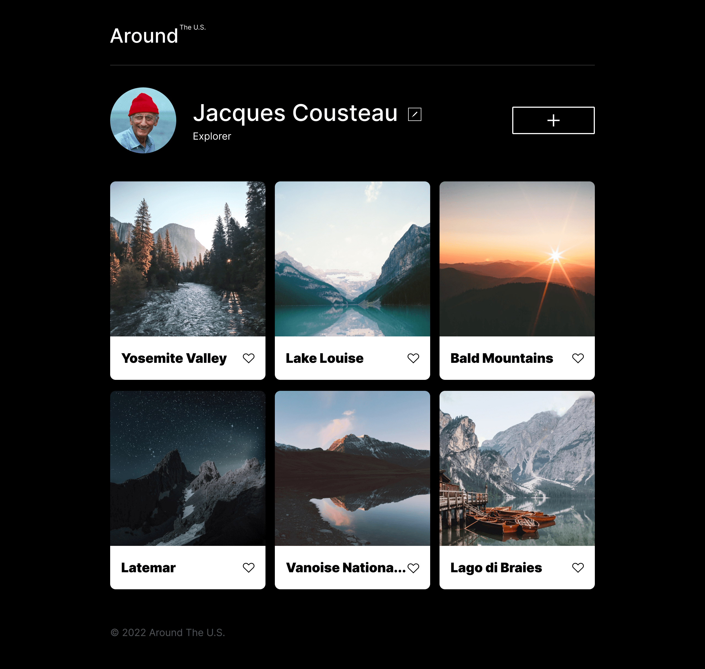
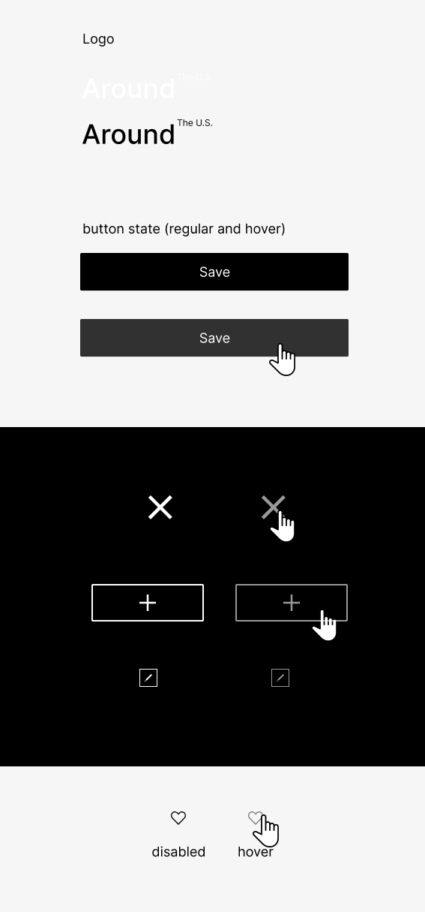

# Project 3: Around The U.S.

### Overview

- Intro
- Project features
- Figma
- Images

**Intro**
This is the third project of the Software Engineering program at TripleTen.
It was created using HTML and CSS, based on the Figma design.  
This project is made so all the elements are displayed correctly on popular screen sizes.
You can access the project using this [Link](https://markalevy.github.io/se_project_aroundtheus/index.html)

**Project features**

- Semantic HTML5
- CSS
- Flexbox
- Grid
- Positioning
- Flat BEM file structure
- responsive design
- @media rules

**Figma**

- [Link to the project on Figma](https://www.figma.com/file/ii4xxsJ0ghevUOcssTlHZv/Sprint-3%3A-Around-the-US?node-id=0%3A1)

**Video**

In [this video](https://drive.google.com/file/d/1Dj6ML_hRxrjZaoZhXGKEmnn1uEVV66yR/view?usp=drive_link), I showcase the third project of the Full stack Developer Program at Triple10. The project was created using HTML and CSS, implementing features like semantic HTML, Flexbox, Grid, and Responsive Design. I demonstrate how the layout adapts to different screen sizes and resolutions, emphasizing the use of grid for a flexible card layout. No specific action is requested from viewers.

**Images**

- 
- 
- 
